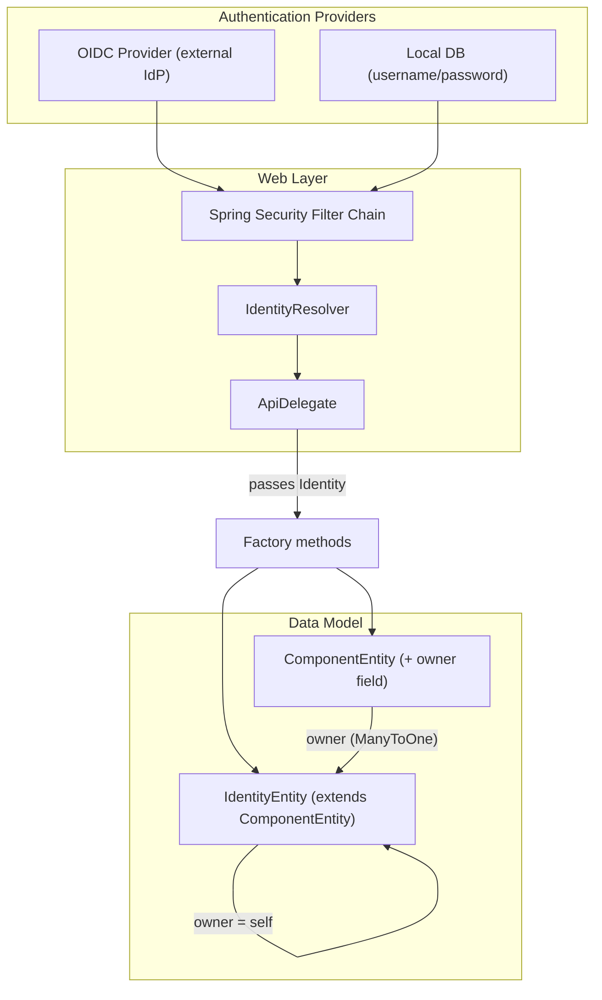

<!-- e0232013-ed4c-480c-b43c-136061eef8ba -->
---
todos:
  - id: "phase-a-identity-model"
    content: "Phase A: Create Identity/IdentityEntity model, add nullable owner field to ComponentEntity, create repository and factory"
    status: pending
  - id: "phase-b-security-infra"
    content: "Phase B: Add Spring Security dependencies, create SecurityConfig (permissive), LocalAuthenticationProvider, IdentityResolver"
    status: pending
  - id: "phase-c-thread-identity"
    content: "Phase C: Modify factory interfaces to accept IdentityEntity, update delegates to resolve and pass identity, propagate owner through all entity creation"
    status: pending
  - id: "phase-d-enforcement"
    content: "Phase D: Enable authentication enforcement on POST endpoints, add owner-based authorization checks"
    status: pending
isProject: false
---
# Authentication and Identity Implementation Plan

## Current State

- No Spring Security dependencies in the project
- No authentication/authorization infrastructure exists
- Web layer uses the OpenAPI delegate pattern: `OffersetsApiDelegateImpl` and `SessionsApiDelegateImpl` extend `BaseDelegateImpl` and receive a `NativeWebRequest` + `Platform`
- Factory methods like `OfferSetFactory.create(IvoaExecutionRequest)` receive only the request body — no caller identity
- All entities inherit from `ComponentEntity` (table `components`, `JOINED` inheritance) which has uuid, name, description, created, modified, and messages

## Architecture Overview



## Part 1: Identity Data Model

### 1.1 Identity interface and entity

Create a new package `net.ivoa.calycopis.broker.engine.entities.identity/` following the existing Component pattern:

- **`Identity.java`** — interface extending `Component`. Adds:
  - `String getUsername()` — unique local username or OIDC subject
  - `URI getIssuer()` — null for local accounts, OIDC issuer URI for federated accounts
  - `String getDisplayName()`

- **`IdentityEntity.java`** — JPA `@Entity` extending `ComponentEntity` with `@Inheritance(JOINED)`. Adds:
  - `@Column(unique=true) String username`
  - `@Column URI issuer` (nullable — null means local account)
  - `@Column String passwordHash` (nullable — null for OIDC-only accounts)
  - `@Column String displayName`
  - The entity references **itself** as its owner (see 1.2 below)

- **`IdentityEntityFactory.java`** — factory interface with:
  - `Optional<IdentityEntity> select(UUID uuid)`
  - `Optional<IdentityEntity> findByUsername(String username)`
  - `Optional<IdentityEntity> findByIssuerAndSubject(URI issuer, String subject)`
  - `IdentityEntity create(String username, String passwordHash)` (local)
  - `IdentityEntity create(URI issuer, String subject, String displayName)` (OIDC)

- **`IdentityEntityRepository.java`** — Spring `@Repository` with custom queries for lookup by username, and by issuer+subject combination.

### 1.2 Owner relationship on ComponentEntity

Add to `ComponentEntity`:

```java
@ManyToOne(fetch = FetchType.LAZY)
@JoinColumn(name = "owner_uuid")
private IdentityEntity owner;
```

Add to the `Component` interface:
```java
public Identity getOwner();
```

All `ComponentEntity` constructors gain an `IdentityEntity owner` parameter. Since `IdentityEntity` extends `ComponentEntity`, its constructor sets `this.owner = this` (self-referencing).

### 1.3 Database schema impact

Because `ddl-auto: create` is used, Hibernate will add:
- A new `identities` table (joined to `components`)
- A new `owner_uuid` FK column on the `components` table

## Part 2: Spring Security Configuration

### 2.1 Dependencies (pom.xml)

Add to `java/pom.xml`:
```xml
<dependency>
    <groupId>org.springframework.boot</groupId>
    <artifactId>spring-boot-starter-security</artifactId>
</dependency>
<dependency>
    <groupId>org.springframework.boot</groupId>
    <artifactId>spring-boot-starter-oauth2-resource-server</artifactId>
</dependency>
<dependency>
    <groupId>org.springframework.security</groupId>
    <artifactId>spring-security-crypto</artifactId>
</dependency>
```

### 2.2 Security configuration class

Create `net.ivoa.calycopis.broker.spring.security.SecurityConfig.java` — a `@Configuration` class defining:

- `SecurityFilterChain` bean:
  - Permits unauthenticated `GET` on `/offersets/{uuid}` and `/sessions/{uuid}` (public read)
  - Requires authentication for `POST` endpoints
  - Configures two authentication mechanisms:
    1. **Bearer token (JWT)** — validated via Spring's OAuth2 Resource Server support using the configured OIDC issuer's JWKS endpoint
    2. **HTTP Basic** — validated against local `IdentityEntity` password hashes in the database
  - CSRF disabled (stateless API)
  - Session management stateless

- `PasswordEncoder` bean (BCrypt)

### 2.3 Local authentication provider

Create `net.ivoa.calycopis.broker.spring.security.LocalAuthenticationProvider.java`:
- Implements `AuthenticationProvider`
- Loads user by username from `IdentityEntityRepository`
- Validates password using `PasswordEncoder`
- Returns a `UsernamePasswordAuthenticationToken` with the `IdentityEntity` UUID as principal

### 2.4 Application configuration

Add to `application.yaml`:
```yaml
spring:
  security:
    oauth2:
      resourceserver:
        jwt:
          issuer-uri: ${OIDC_ISSUER_URI:https://accounts.example.org}

calycopis:
  security:
    public-read: true
```

Externalise the OIDC issuer URI via environment variable, consistent with the existing pattern of external config (like `/etc/calycopis/database.yaml`).

## Part 3: Identity Resolution in the Web Layer

### 3.1 IdentityResolver service

Create `net.ivoa.calycopis.broker.spring.security.IdentityResolver.java`:
- A `@Service` that takes a Spring `Authentication` object and returns the corresponding `IdentityEntity`
- For JWT tokens: extracts `issuer` + `subject` claims, looks up or creates (auto-provisioning) an `IdentityEntity`
- For Basic auth: the `IdentityEntity` UUID is already in the authentication principal (from `LocalAuthenticationProvider`)
- For anonymous access (if allowed): returns a well-known "anonymous" `IdentityEntity`

### 3.2 Modify BaseDelegateImpl

Add to `BaseDelegateImpl`:
- Inject `IdentityResolver`
- Add a `getIdentity()` method that calls `SecurityContextHolder.getContext().getAuthentication()` and resolves it to an `IdentityEntity`

### 3.3 Modify delegate implementations

In `OffersetsApiDelegateImpl.offerSetPost()`:
```java
IdentityEntity identity = this.getIdentity();
OfferSetEntity entity = this.platform.getOfferSetFactory().create(request, identity);
```

In `SessionsApiDelegateImpl.directExecutionPost()`:
```java
IdentityEntity identity = this.getIdentity();
SimpleExecutionSessionEntity entity = platform.getOfferSetFactory().direct(request, identity);
```

Similarly for `executionUpdatePost()`.

## Part 4: Threading Identity Through Factories

### 4.1 Factory interface changes

Update `OfferSetFactory`:
```java
public OfferSetEntity create(IvoaExecutionRequest request, IdentityEntity owner);
public SimpleExecutionSessionEntity direct(IvoaExecutionRequest request, IdentityEntity owner);
```

### 4.2 Factory implementation changes

`OfferSetFactoryImpl.create()` passes the owner to:
- `OfferSetRequestParserContext` (add owner field)
- All entity creation calls downstream (sessions, compute, storage, data, executable, volume entities)

Each entity factory's `create()` method gains an `IdentityEntity owner` parameter that is passed to the entity constructor.

### 4.3 ComponentEntity constructor chain

All `ComponentEntity` constructors become:
```java
protected ComponentEntity(final String name, final IdentityEntity owner)
protected ComponentEntity(final IvoaComponentMetadata meta, final IdentityEntity owner)
protected ComponentEntity(final String name, final String description, final Instant created, final IdentityEntity owner)
```

This is a wide-reaching change but mechanical — every subclass constructor adds the owner parameter and passes it up.

## Part 5: Implementation Sequence

The work should be done in phases to keep the project compilable between steps:

1. **Phase A** — Add the `owner` field to `ComponentEntity` as nullable (no constraint), add the `Identity`/`IdentityEntity` classes. No security yet — all owners are null. Project compiles and tests pass.

2. **Phase B** — Add Spring Security dependencies, `SecurityConfig`, `LocalAuthenticationProvider`, and `IdentityResolver`. All endpoints initially permit all (no enforcement). Project still works without auth.

3. **Phase C** — Modify factory interfaces and implementations to accept `IdentityEntity owner`. The delegates resolve identity and pass it through. For unauthenticated requests, use the anonymous identity.

4. **Phase D** — Enable security enforcement: require authentication on POST endpoints. Add authorization checks (only owner can update their sessions).

## Key Files to Create

| File | Package |
|------|---------|
| `Identity.java` | `engine.entities.identity` |
| `IdentityEntity.java` | `engine.entities.identity` |
| `IdentityEntityFactory.java` | `engine.entities.identity` |
| `IdentityEntityFactoryImpl.java` | `spring.identity` |
| `IdentityEntityRepository.java` | `spring.jpa` |
| `SecurityConfig.java` | `spring.security` |
| `LocalAuthenticationProvider.java` | `spring.security` |
| `IdentityResolver.java` | `spring.security` |

## Key Files to Modify

| File | Change |
|------|--------|
| `ComponentEntity.java` | Add `owner` ManyToOne field + constructor param |
| `Component.java` | Add `getOwner()` |
| `OfferSetFactory.java` | Add `IdentityEntity` param to `create()` and `direct()` |
| `OfferSetFactoryImpl.java` | Thread owner through to entity creation |
| `BaseDelegateImpl.java` | Add `getIdentity()` via `IdentityResolver` |
| `OffersetsApiDelegateImpl.java` | Call `getIdentity()` and pass to factory |
| `SessionsApiDelegateImpl.java` | Call `getIdentity()` and pass to factory |
| `pom.xml` | Add spring-security and oauth2 dependencies |
| `application.yaml` | Add OIDC and security config |
| All entity constructors | Add `owner` parameter (mechanical propagation) |

## Risks and Considerations

- **Wide constructor change**: Adding `owner` to `ComponentEntity` touches every entity class in the project. Phase A mitigates this by making it nullable first.
- **Processing loop**: Entities created by the processing loop (e.g. during session lifecycle transitions) inherit the owner from the parent session — no identity resolution needed in the background thread.
- **OpenAPI delegate pattern**: The generated controller interfaces cannot be modified, but the delegate implementations have full access to `NativeWebRequest` and can use `SecurityContextHolder` to retrieve authentication.
- **OIDC auto-provisioning**: First-time OIDC users get an `IdentityEntity` created automatically on their first authenticated request.
